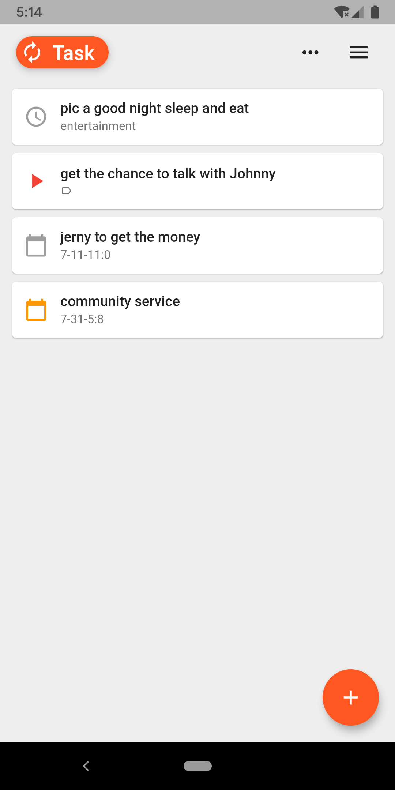
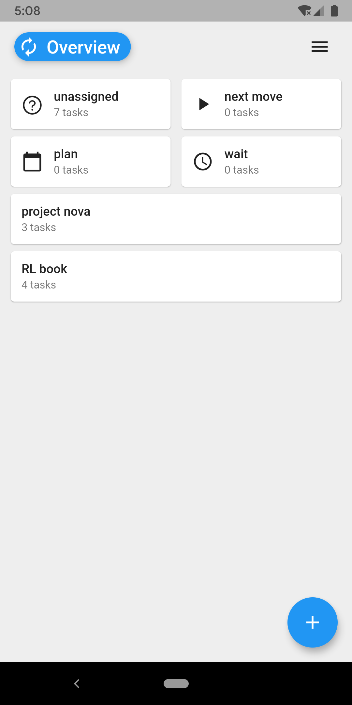
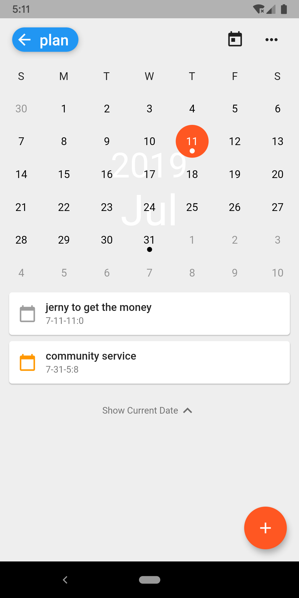
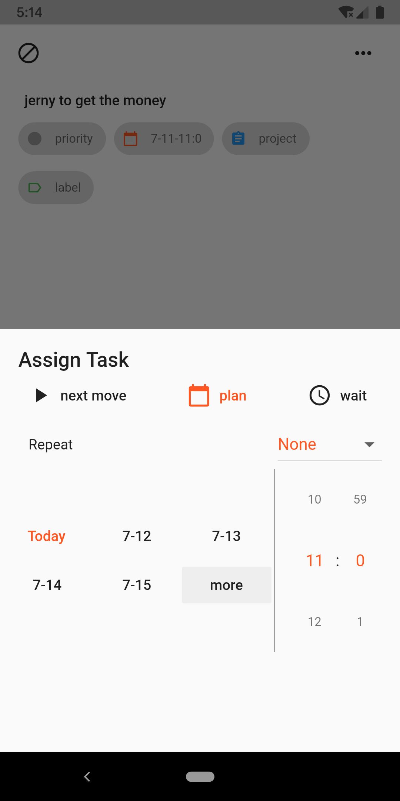

# forget

An iOS and android app build by [Flutter](https://flutter.io/docs)

[app store link](https://apps.apple.com/cn/app/forget-%E6%97%B6%E9%97%B4%E7%AE%A1%E7%90%86/id1448659423)
## preview
|||
| :---------------------------: | :---------------------------: |
|||

## fetures
* State Management: [Provider](https://github.com/rrousselGit/provider)
* Persistence: [sqflite](https://github.com/tekartik/sqflite) + [shared_preferences](https://github.com/flutter/plugins/tree/master/packages/shared_preferences)
* International: [i18n](https://github.com/long1eu/flutter_i18n)

